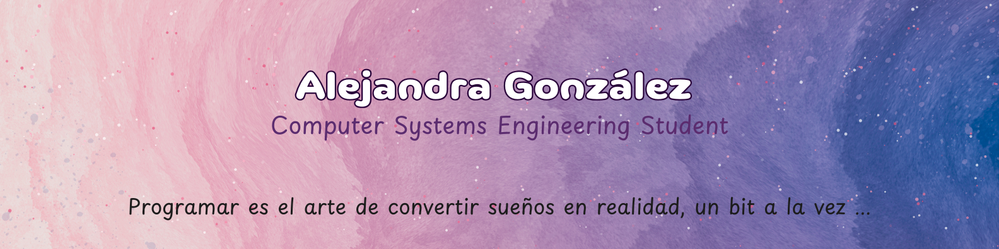

_____
# 👋🏽 **Sobre mí**
- 👩🏽 **Nombre**: Alejandra González Madrid
- 🌎 **Ubicación**: Hermosillo, Sonora, México
- 👩🏽‍💻 **Ocupación**: Estudiante de ingeniería en sistemas computacionales (18/41 módulos) y Asesora de Call Center
- 👾 **Habilidades**: SQL, Scrum, Python, Visual Studio Code, HTML, CSS, JavaScript
